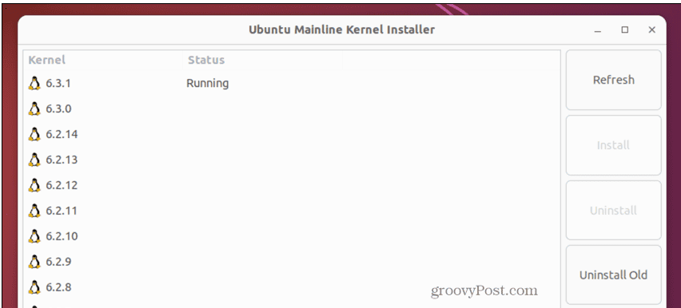
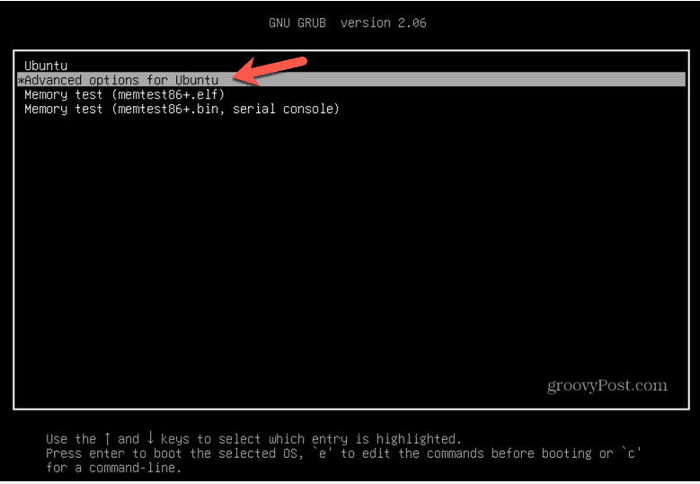
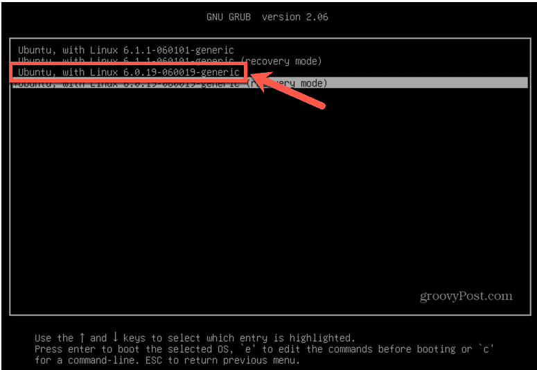
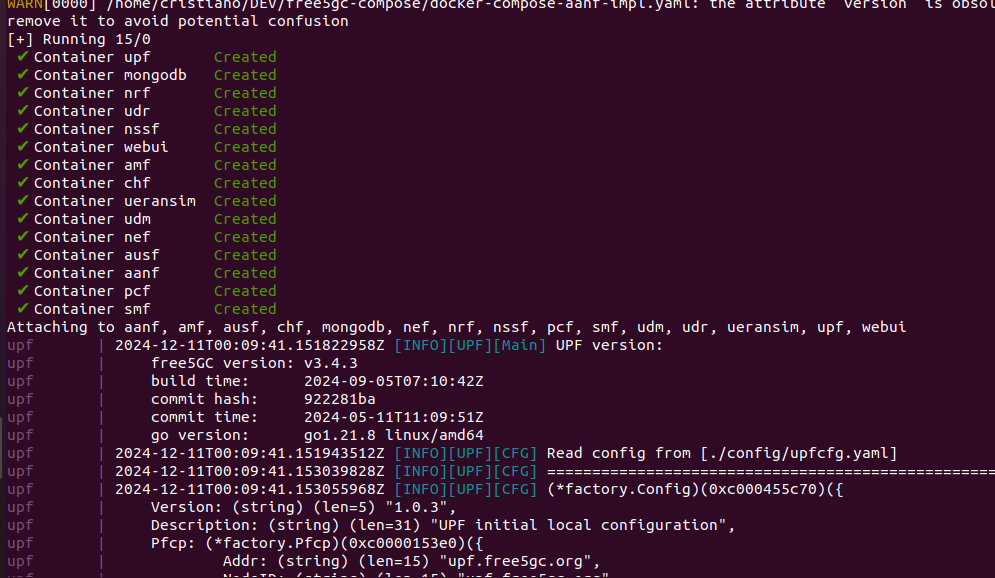

# free5GC Compose (AANF Implementation)

This repository is a fork of the [free5GC project](https://github.com/free5gc/free5gc) and aims to implement the AANF module.

## Installation Guide

### Operating System

To run the ecosystem, it is recommended to use **Ubuntu 20.04.6 LTS (Focal Fossa)**.

Available at: [Ubuntu Releases](https://releases.ubuntu.com/focal/)

After installing Ubuntu, it is necessary to downgrade to kernel `5.4.0-60-generic`.

Follow the tutorial available on [groovypost](https://www.groovypost.com/howto/how-to-downgrade-the-kernel-in-ubuntu/) to downgrade the kernel:

```bash
# Open a terminal and enter the following commands to install mainline:
sudo apt-add-repository -y ppa:cappelikan/ppa
sudo apt update
sudo apt install mainline
```

Once installed, launch the **Ukuu Mainline Kernel Installer** app. The currently running kernel will be listed.



Select an earlier version of the Linux kernel and click **Install**.

Wait for the installation to complete. Restart your computer and boot into the selected kernel.

- **To access the GRUB menu**:
    - Hold down **Esc** if your system uses UEFI or **Shift** if it uses BIOS during the startup process.
    - Use the Down Arrow key to select **Advanced Options for Ubuntu**.



- Select the desired kernel version. The lower the version number, the older the kernel.



Press **Enter**, and Ubuntu will boot using the selected kernel.

As an initial requirement, download the **GTP5G Kernel Module**.

### GTP5G Kernel

The [GTP5G kernel module](https://github.com/free5gc/gtp5g) is required to initialize the compose setup.

Download the repository at version tag `0.8.10`:

```bash
git clone --branch v0.8.10 --depth 1 https://github.com/free5gc/gtp5g.git

# Compile
cd gtp5g
make clean && make

# Install the kernel module
sudo make install
```

This will install the module and configure it to load automatically at boot.

### Docker Engine

The ecosystem runs on Docker, so installing the [Docker Engine](https://docs.docker.com/engine/install) is required.

```bash
# Set up Docker's apt repository
sudo apt-get update
sudo apt-get install ca-certificates curl
sudo install -m 0755 -d /etc/apt/keyrings
sudo curl -fsSL https://download.docker.com/linux/ubuntu/gpg -o /etc/apt/keyrings/docker.asc
sudo chmod a+r /etc/apt/keyrings/docker.asc

# Add Docker's repository
echo \
"deb [arch=$(dpkg --print-architecture) signed-by=/etc/apt/keyrings/docker.asc] https://download.docker.com/linux/ubuntu \
$(. /etc/os-release && echo "$VERSION_CODENAME") stable" | \
sudo tee /etc/apt/sources.list.d/docker.list > /dev/null
sudo apt-get update

# Install Docker
sudo apt-get install docker-ce docker-ce-cli containerd.io docker-buildx-plugin docker-compose-plugin

# Verify installation
sudo docker run hello-world
```

### free5GC Compose - Modifications

This repository is a fork of the original project. While the original compose setup uses Docker images from public repositories, the AANF implementation required changes. The AANF project was developed within this directory: `src/aanf`.

Additionally, the **AUSF** module required modifications, and a fork was created: [ausf](https://github.com/gustavojardim/ausf).

In the compose configuration, other modules use Docker images from public repositories, while **AANF** and **AUSF** are built and deployed locally.

### free5GC Compose - Installation

Clone this repository:

```bash
git clone https://github.com/gustavojardim/free5gc-compose
cd free5gc-compose

# Clone free5GC sources
cd base
git clone --recursive -j $(nproc) https://github.com/free5gc/free5gc.git
cd ..
```

### Download Edited AUSF Implementation

An automated script is available in the project's root directory to clone the AUSF implementation. Run the following commands:

```bash
# Grant execute permissions
sudo chmod 777 aanf_impl.sh

# Execute the script
./aanf_impl.sh
```

The AUSF project will be cloned and placed within the compose directory.

### free5GC Compose - Build

To build the images, run:

```bash
make all
docker compose -f docker-compose-aanf-impl.yaml build
```

### free5GC Compose - Run

To start the compose setup, execute:

```bash
sudo docker compose -f docker-compose-aanf-impl.yaml up
```

This will launch all modules, including the locally compiled **AUSF** and **AANF**.



### free5GC Compose - Web UI

To access the free5GC web interface:

- Navigate to: `http://localhost:5000`
- Default credentials:
    - **Username**: admin
    - **Password**: free5gc


### PacketRusher - Installation

**PacketRusher** is a tool based on **my5G-RANTester**, designed for performance testing and automatic validation of 5G Core Networks using simulated UE (user equipment) and gNodeB (5G base station).

If you have questions or comments, feel free to open an issue.

#### Dependencies

```bash
sudo apt install build-essential linux-headers-generic make git wget tar linux-modules-extra-$(uname -r)

# Warning: This will remove any existing local Go installation
wget https://go.dev/dl/go1.21.3.linux-amd64.tar.gz && sudo rm -rf /usr/local/go && sudo tar -C /usr/local -xzf go1.21.3.linux-amd64.tar.gz

# Add Go binary to the executable PATH
echo 'export PATH=$PATH:/usr/local/go/bin' >> $HOME/.profile
source $HOME/.profile
```

#### Download PacketRusher Source Code

```bash
git clone https://github.com/HewlettPackard/PacketRusher
cd PacketRusher && echo "export PACKETRUSHER=$PWD" >> $HOME/.profile
source $HOME/.profile
```

#### Build free5GC's GTP5G Kernel Module

```bash
cd $PACKETRUSHER/lib/gtp5g
make clean && make && sudo make install
```

#### Build PacketRusher CLI

```bash
cd $PACKETRUSHER
go mod download
go build cmd/packetrusher.go
./packetrusher --help
```

### PacketRusher - Run

Before running PacketRusher, verify the configurations in:

```text
config/config.yml
```

Once the configurations are correct, run PacketRusher:

```bash
sudo ./PacketRusher ue
```

# Demonstration - UE Configuration and Key Registration Tests

(To be completed)

This section will detail the steps to configure UEs and demonstrate key registration tests, including AKMA configurations and their validations.


## References

- [free5GC](https://github.com/free5gc/free5gc.git)
- [PacketRusher](https://github.com/HewlettPackard/PacketRusher)
- [Open5GS Docker](https://github.com/open5gs/nextepc/tree/master/docker)
- [Docker-Free5GC](https://github.com/abousselmi/docker-free5gc)